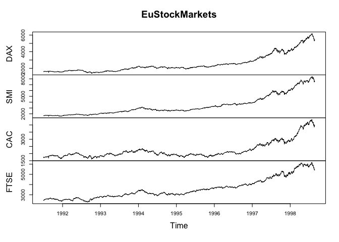
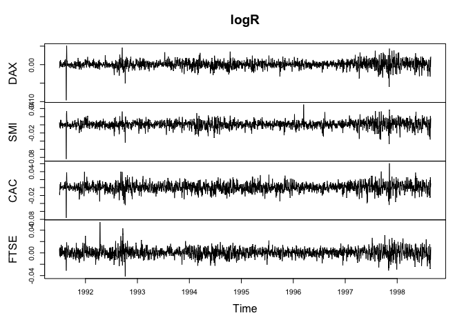
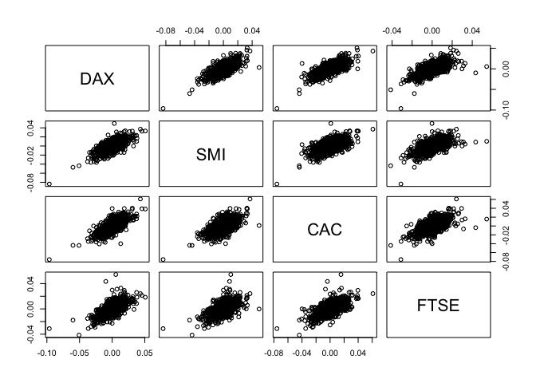
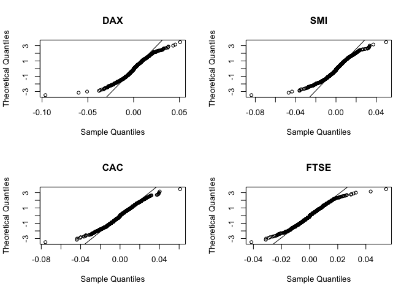
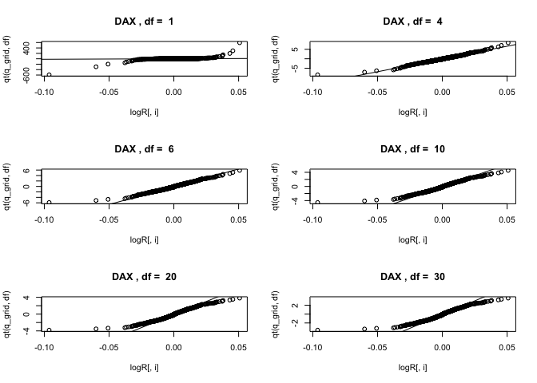
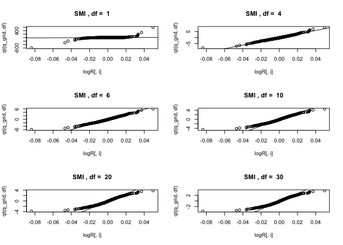
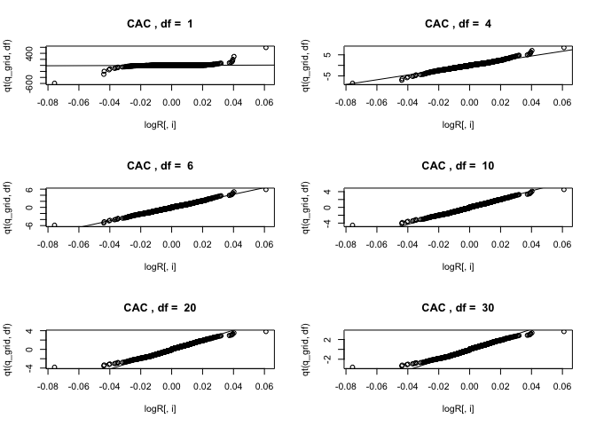
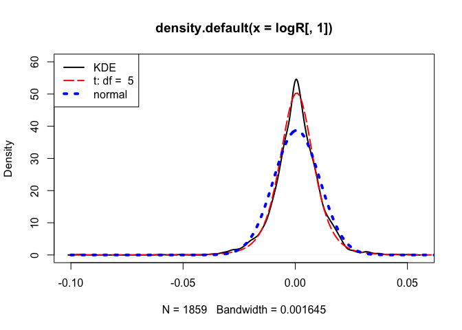

Untitled
================

## GitHub Documents

This is an R Markdown format used for publishing markdown documents to
GitHub. When you click the **Knit** button all R code chunks are run and
a markdown file (.md) suitable for publishing to GitHub is generated.

## Including Code

You can include R code in the document as follows:

``` r
summary(cars)
```

    ##      speed           dist       
    ##  Min.   : 4.0   Min.   :  2.00  
    ##  1st Qu.:12.0   1st Qu.: 26.00  
    ##  Median :15.0   Median : 36.00  
    ##  Mean   :15.4   Mean   : 42.98  
    ##  3rd Qu.:19.0   3rd Qu.: 56.00  
    ##  Max.   :25.0   Max.   :120.00

## Including Plots

You can also embed plots, for example:

<!-- -->

Note that the `echo = FALSE` parameter was added to the code chunk to
prevent printing of the R code that generated the plot.

``` r
data(EuStockMarkets)
mode(EuStockMarkets)
```

    ## [1] "numeric"

``` r
class(EuStockMarkets)
```

    ## [1] "mts"    "ts"     "matrix"

``` r
plot(EuStockMarkets)

#pdf("EuStocks.pdf", width = 6, height = 5)
plot(EuStockMarkets)
```

<!-- -->

``` r
logR = diff(log(EuStockMarkets))
plot(logR)
```

<!-- -->

``` r
plot(as.data.frame(logR))
```

<!-- -->

``` r
par(mfrow=c(2, 2))
for(i in colnames(logR))
{
  print(i)
  qqnorm(logR[ ,i], datax = T, main = i)
  qqline(logR[ ,i], datax = T)
  print(shapiro.test(logR[ ,i]))
}
```

    ## [1] "DAX"

    ## 
    ##  Shapiro-Wilk normality test
    ## 
    ## data:  logR[, i]
    ## W = 0.95384, p-value < 2.2e-16
    ## 
    ## [1] "SMI"

    ## 
    ##  Shapiro-Wilk normality test
    ## 
    ## data:  logR[, i]
    ## W = 0.95537, p-value < 2.2e-16
    ## 
    ## [1] "CAC"

    ## 
    ##  Shapiro-Wilk normality test
    ## 
    ## data:  logR[, i]
    ## W = 0.98203, p-value = 1.574e-14
    ## 
    ## [1] "FTSE"

<!-- -->

    ## 
    ##  Shapiro-Wilk normality test
    ## 
    ## data:  logR[, i]
    ## W = 0.97994, p-value = 1.754e-15

``` r
n=dim(logR)[1]
q_grid=(1:n)/(n+1)
df_grid = c(1, 4, 6, 10, 20, 30)
index.names = dimnames(logR)[[2]]
for(i in 1:4){
  # dev.new() 
  par(mfrow = c(3, 2)) 
  for(df in df_grid){
    qqplot(logR[,i], qt(q_grid,df),
           main = paste(index.names[i], ", df = ", df) )
    abline(lm(qt(c(0.25, 0.75), df = df) ~
                quantile(logR[,i], c(0.25, 0.75))))
  }
}
```

<!-- --><!-- --><!-- --><!-- -->

``` r
library("fGarch")
```

    ## Warning: package 'fGarch' was built under R version 3.4.4

    ## Loading required package: timeDate

    ## Loading required package: timeSeries

    ## Loading required package: fBasics

``` r
x=seq(-0.1, 0.1,by = 0.001)
par(mfrow = c(1, 1)) 
df=5
mad_t = mad(logR[ , 1],
            constant = sqrt(df / (df - 2)) / qt(0.75, df))
plot(density(logR[ , 1]), lwd = 2, ylim = c(0, 60))
lines(x, dstd(x, mean = mean(logR[,1]), sd = mad_t, nu = df),
      lty = 5, lwd = 2, col = "red")
lines(x, dnorm(x, mean = mean(logR[ ,1]), sd = sd(logR[ ,1])),
      lty = 3, lwd = 4, col = "blue")
legend("topleft", c("KDE", paste("t: df = ",df), "normal"),
       lwd = c(2, 2, 4), lty = c(1, 5, 3),
       col = c("black", "red", "blue"))
```

<!-- -->
